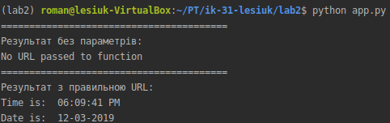
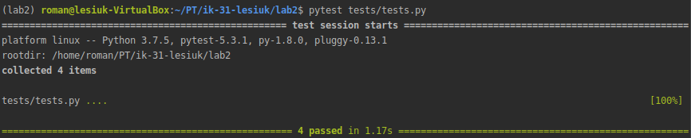

# Lab_2: Автоматизація. Знайомство з CI/CD.

1. Ствоюю папку `lab2` з `README.md` файлом.
2. За допомогою пакетного менеджера PIP інсталюю `pipenv `та створюю ізольоване середовище для Python. Ознайомлююся з командаю `pipenv -h`.
    ```
    pip install pipenv
    pipenv --python 3.7
    pipenv shell
    ```

3. Встановлюю бібліотеку `requests` у середовищі. Також встановіть бібліотеку `ntplib`, яка працює з часом:
    ```
    pipenv install requests
    pipenv install ntplib
    ```

4. Створюю файл `app.py` і копіюю код програи із репозиторію до себе.

5. Переконуюся, що програма працює правильно, виконавши команду:
   ```
   python app.py
   ```
    
    
6. Встановлюю бібліотеку `pytest`, виконавши команду:
    ```
    pipenv install pytest
    ```
   
7. Копіюю приклади тестів та виконую їх командою 
    ```
    pytest tests/tests.py
    ```
    Тести виконалися успішно: 
    
    
    
8. 