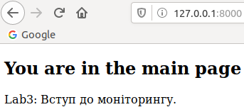
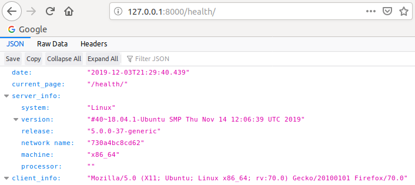

# Lab_4: Робота з Docker

1. Ознайомлююся з документацією `Docker`.
2. Для перевірки чи докер встановлений і працює правильно на віртуальній машині запускаю перевірку версії, виведення допомоги та тестовий імедж. Перенаправляю вивід цих команд у файл `my_work.log` та комічу його до репозиторію:
    ```
    docker -v 
    docker -h
    docker run docker/whalesay cowsay Docker is fun 
    ```
3. Ознайомлююся з документацією Dockerfile, який описує контент імеджу.
4. Для знайомства з `Docker` створюю імедж із `Django` сайтом зробленим у попередній лабораторній:

    - Використавую команди, щоб завантажити базовий імедж з репозиторію:
    ```
    docker pull python:3.7-slim
    docker images
    docker inspect python:3.7-slim
    ```
    - Створюю файл з іменем `Dockerfile` та скопіюю туди вміс з репозиторію `devops_course`;
    - Ознайомлююся із коментарями, щоб зрозуміти структуру написання `Dockerfile`;
    - Замінюю посилання на власний `Git` репозиторій із сайтом та комічу даний `Dockerfile`.
    
5. Створюю власний репозиторій на `Docker Hub`. Для цього заходжу у власний аккаунт на `Docker Hub`, після чого переходжу у вкладку `Repositories` і далі натискаю кнопку `Create new repository`. Даю назву репозиторію `lab4example`.

6. Виконую білд (build) Docker імеджа та завантажую його до репозиторію. Оскільки мій репозиторій `nkc120/lab4example` то виконую команди:

    ```
    docker build -t nkc120/lab4example:django .
    docker images
    docker push nkc120/lab4example:django
    ```
   - [Посилання на Docker Hub](https://cloud.docker.com/repository/docker/nkc120/lab4example);
   - Посилання на скачування: `nkc120/lab4example:django`.

7. Для запуску сайту виконую команду:

       ```
       docker run -it --name=django --rm -p 8000:8000 nkc120/lab4example:django
       ```
       
      - переходжу на адресу `http://127.0.0.1:8000 `та переконуюся, що Ваш веб-сайт працює:
      
      
      
      
      
8. 