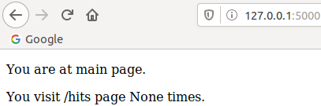
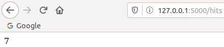
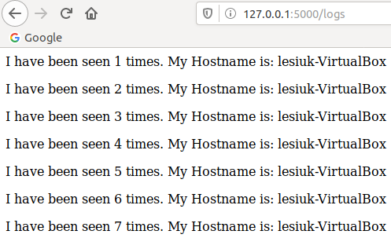
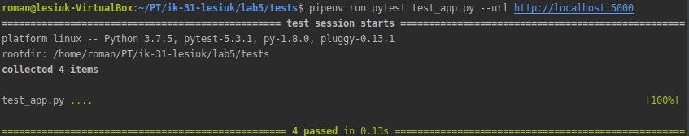

# Lab_5: Автоматизація за допомогою Makefile VS Docker Compose

1. Створюю папку `my_app`, в якій буде знаходитись проект. Створюю папку `tests` де будуть тести на перевірку працездатності проекту. Копіюю файли з репозиторію у відповідні папки мого репозиторію. Переглядаю файл `requirements.txt` у папці проекту та тестах.
2. Перевіряю чи проект є працездатним. Ініціалізувавши середовища, виконую наступні команди:
    ```
    pipenv --python 3.7
    pipenv install -r requirements.txt
    pipenv run python app.py
    ```
   - Виправляю помилку `redis.exceptions.ConnectionError`, що виникла при спробі запустити додатку:
        - Встановлюю `redis-server`, виконавши команду `sudo apt install redis-server`;
        - Роблю зміни у конфігураційному файлі /etc/redis/redis.conf. 
        - Пропипую у файлі `/etc/hosts` перенаправлення запитів `redis` на локальну адресу `127.0.0.1 redis`;
   - Переконуюся, що головна сторінка працює:
   
     
   
   - Створюю папку `logs` для того, щоб працювали сторінки `/hits` та `/logs`. Переконуюся, що після цього вони працюють:
   
        
   
        
   
3. Ініціалузовую середовище для тестів у іншій вкладці терміналу та запускаю їх командою:
     ```
     pipenv run pytest test_app.py --url http://localhost:5000
     ```
   - Тести виконалися успішно:
   
     
    
    - Видаляю файли `Pipfile` та `Pipfile.lock`.
    